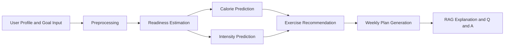

# Smart Workout

<p align="center">
  <a href="https://smart-workout-frk3.onrender.com"></a>
  <a href="https://smart-workout-frk3.onrender.com/docs"></a>
  <a href="https://smart-workout-frk3.onrender.com/api/v1/health"></a>
</p>

<p align="center">
Decision Support and Business Intelligence platform for personalized training plans,
prediction-backed recommendations, and retrieval-grounded workout guidance.
</p>

## Live Hosted Deployment

The application is live and publicly hosted on Render.

- Live app: https://smart-workout-frk3.onrender.com
- API docs: https://smart-workout-frk3.onrender.com/docs
- Health check: https://smart-workout-frk3.onrender.com/api/v1/health

Note: Render free-tier services may cold start after inactivity.

## Overview

Smart Workout integrates four layers in one end-to-end workflow:

- Descriptive analytics for membership behavior, lifestyle segments, and readiness context
- Predictive modeling for calorie burn and workout intensity
- Prescriptive plan generation for weekly training structure
- Retrieval-grounded assistant responses for explainability and exercise substitutions

## Core Features

- Dual interfaces:
  - User dashboard for personalized planning
  - Executive dashboard for BI monitoring and segment insights
- End-to-end planning flow from profile input to weekly workout plan
- XGBoost-based prediction stack with saved artifacts for runtime inference
- Rule-based weekly split generation using readiness, goal, equipment, and target body part
- RAG chat endpoint and in-app assistant for grounded plan explanations

## Workflow



Interpretation:

- Readiness is estimated from profile and context.
- Calories and intensity are model predictions.
- Weekly plans are generated after prediction outputs are available.

## Tech Stack

| Layer | Technologies |
|---|---|
| Backend | FastAPI, Pydantic, pandas, numpy, scikit-learn, XGBoost, ChromaDB, sentence-transformers |
| Frontend | React, TypeScript, Vite, Recharts, Tailwind CSS, Lucide React |
| Data and Modeling | Gym datasets, ExerciseDB-derived catalog, clustering outputs, trained artifacts in models/ |
| Deployment | Render Web Service plus Static Site via render.yaml |

## API Endpoints

| Endpoint | Method | Purpose |
|---|---|---|
| /api/v1/health | GET | Service health |
| /api/v1/health/readiness | GET | Data and model readiness check |
| /api/v1/dashboard/summary | GET | Aggregated dashboard payload |
| /api/v1/workout/preprocess | POST | Input preprocessing |
| /api/v1/workout/predict-calories | POST | Calorie burn prediction |
| /api/v1/workout/predict-intensity | POST | Intensity prediction |
| /api/v1/workout/recommend-exercises | POST | Exercise recommendation |
| /api/v1/workout/generate-plan | POST | Weekly plan generation |
| /api/v1/chat | POST | Retrieval-grounded chat response |

## Project Structure

```text
backend/                 FastAPI app, API routers, services, schemas, tests
frontend/                React app (user and executive dashboards)
data/raw/                Original source datasets
data/processed/          Cleaned tables, marts, and model-ready data
models/                  Trained model artifacts and evaluation outputs
scripts/                 Reproducible training and indexing scripts
docs/                    Run guides, demo assets, RAG docs
notebooks/               Week 1 and Week 2 analysis notebooks
render.yaml              Render blueprint for backend and frontend deployment
```

## Local Setup

### Prerequisites

- Python 3.11+
- Node.js 18+
- npm

### 1. Backend

```powershell
python -m venv .venv
Set-ExecutionPolicy -Scope Process -ExecutionPolicy RemoteSigned
.\.venv\Scripts\Activate.ps1
python -m pip install --upgrade pip
python -m pip install -r backend\requirements.txt

$env:PYTHONPATH = "backend"
python -m uvicorn app.main:app --app-dir backend --host 127.0.0.1 --port 8000 --reload
```

Backend local URLs:

- API root: http://127.0.0.1:8000
- API docs: http://127.0.0.1:8000/docs
- Health: http://127.0.0.1:8000/api/v1/health

### 2. Frontend

Open a second terminal:

```powershell
cd frontend
cmd /c npm install
cmd /c npm run dev
```

Frontend local URL:

- http://127.0.0.1:5173

## Quality Checks

```powershell
python -m pytest backend\tests -q
cd frontend
cmd /c npm run build
```

## Deployment Notes

- The repository includes Render blueprint configuration in render.yaml.
- Backend and frontend can be deployed together from the same repo.
- Required environment variables:
  - Backend: CORS_ALLOW_ORIGINS, RAG_MODE, SERVE_FRONTEND, CHAT_TIMEOUT_SECONDS, GENERATE_PLAN_TIMEOUT_SECONDS
  - Frontend: VITE_API_URL, VITE_API_V1

Quick Render checklist:

1. Deploy with render.yaml (Blueprint) so both services are created.
2. Backend environment:
  - CORS_ALLOW_ORIGINS=https://<frontend-domain>
  - RAG_MODE=keyword
  - SERVE_FRONTEND=false
  - CHAT_TIMEOUT_SECONDS=30
  - GENERATE_PLAN_TIMEOUT_SECONDS=45
3. Frontend environment:
  - VITE_API_URL=https://<backend-domain>
  - VITE_API_V1=/api/v1
4. Redeploy backend, then redeploy frontend.
5. Verify:
  - GET /api/v1/health returns status ok
  - Generate Plan works
  - Chat responds and does not hang indefinitely

## Documentation

- docs/WEEK1_WEEK2_RUN_STEPS.md
- docs/demo_script.md
- frontend/README.md
- MODEL_RESULTS.md

## Current Status

Working prototype with deployed live environment, predictive planning flow, and retrieval-grounded explanation support.
